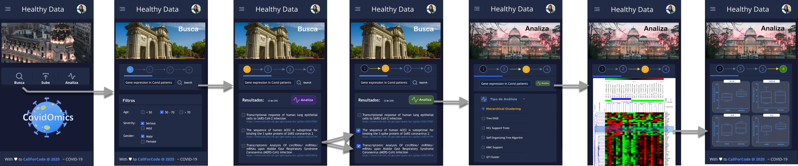
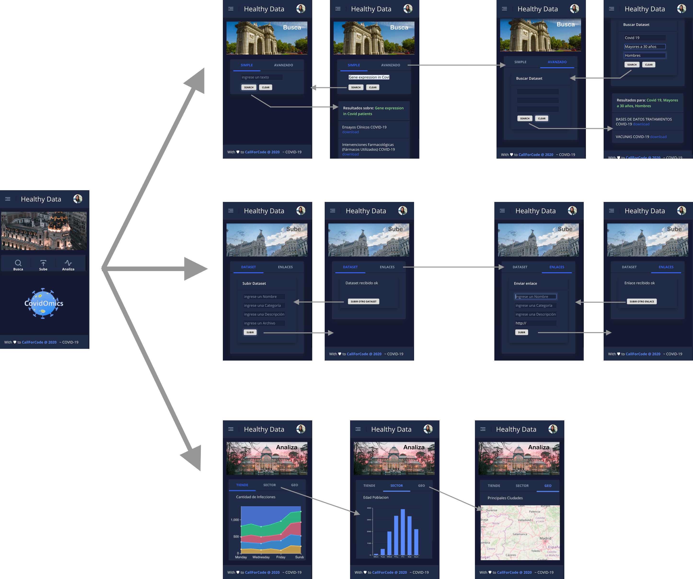

# Hack_Call4Code
Prototipo para Call4Code

# HealthyData

PoC Aplicación [CallForCode COVID-19 Track](https://developer.ibm.com/callforcode/getstarted/covid-19/) 2020

Organizado por: ONU + IBM

# Demo Mobile

# Workflow Específico

# Workflow general

